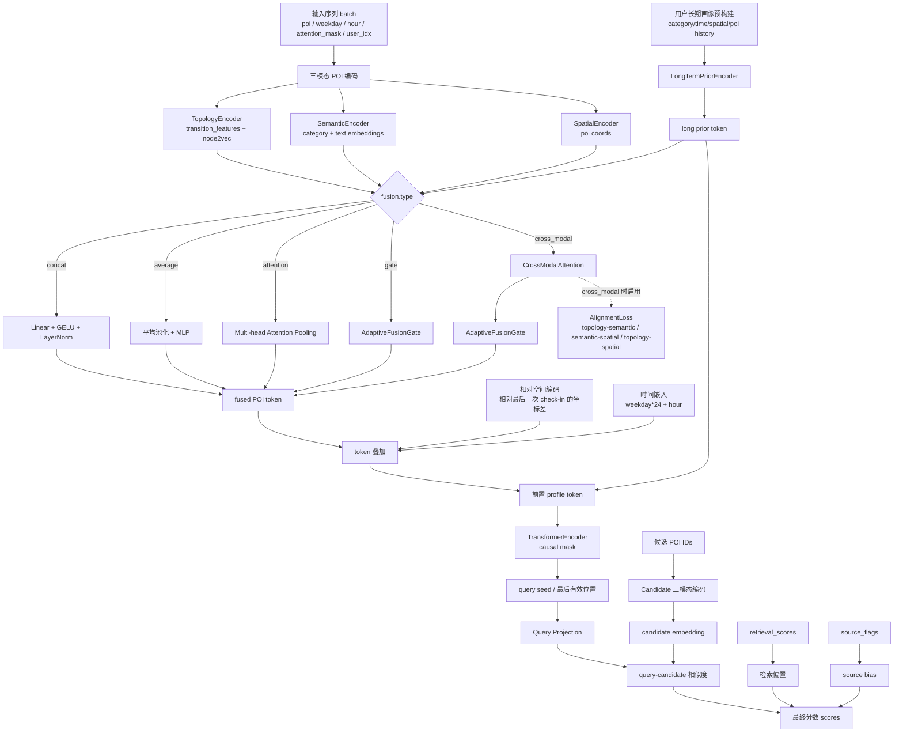

# 多模态融合改进模型实验记录

## 1. 本次修改目标

根据 `POI_multimodal_fusion_code_modification_prompt.md`，本次没有做完整的融合方法对比实验，而是先实现一个**修改后的跨模态融合模型**，并跑一轮全量实验验证其可运行性与初步效果。

本次实现的核心模块包括：

1. **CrossModalAttention**

   - 在拓扑、语义、空间三模态之间建立交互；
   - 实现 topology-aware semantic、semantic-aware spatial、semantic-aware topology 的残差增强。
2. **AdaptiveFusionGate**

   - 结合用户长期偏好上下文，对三模态动态分配权重；
   - 输出 topology / semantic / spatial 三个融合权重。
3. **AlignmentLoss**

   - 对 topology-semantic、semantic-spatial、topology-spatial 三组模态表示施加 InfoNCE 一致性约束；
   - 作为推荐损失之外的辅助损失。

## 2. 代码修改位置

- 新增：`poi_rec/models/fusion.py`
- 修改：`poi_rec/models/poi_model.py`
- 修改：`poi_rec/training/train.py`
- 修改：`tests/test_model_forward.py`

## 3. 融合方式说明

### 3.1 当前最新模型结构图

> 说明：当前**实际主模型**是 `poi_rec/models/poi_model.py` 中的 `PriorConditionedPOIModel`；
> `poi_rec/models/prior_conditioned_fusion.py` 只是早期的简化融合模块，**不是**当前最新实验使用的主干。



### 3.2 当前最新实验对应的融合路径

当前 `fusion.md` 记录的“最新融合实验”对应配置为：

```yaml
fusion:
  type: cross_modal
  num_heads: 4
  dropout: 0.1
  alignment_loss_weight: 0.01
```

因此实际走的是下面这条路径：

1. **三模态独立编码**：Topology / Semantic / Spatial；
2. **CrossModalAttention**：
   - topology-aware semantic
   - semantic-aware spatial
   - semantic-aware topology
3. **AdaptiveFusionGate**：结合 `long prior token` 对三模态动态分配权重；
4. **token 级特征叠加**：融合后的 POI token + 相对空间编码 + 时间嵌入；
5. **序列建模**：在序列前拼接长期用户画像 token，再输入 TransformerEncoder；
6. **候选重排**：对动态候选集计算 query-candidate 相似度，并叠加 retrieval bias 与 source bias；
7. **辅助约束**：训练时额外加入三组模态对齐的 `AlignmentLoss`。

### 3.3 一句话概括

当前最新模型可以概括为：

> **三模态 POI 编码 + 跨模态交互 + 长期偏好条件化门控融合 + Transformer 序列编码 + 动态候选重排 + 跨模态对齐约束**

为保证 baseline 可保留，模型增加了可配置融合方式：

- `concat`
- `average`
- `attention`
- `gate`
- `cross_modal`

本次实验实际启用的是：

```yaml
fusion:
  type: cross_modal
  num_heads: 4
  dropout: 0.1
  alignment_loss_weight: 0.01
```

即：

**跨模态交互 + 动态门控融合 + 一致性约束**

## 4. 单元测试结果

运行命令：

```bash
/opt/conda/envs/py11/bin/python -m unittest tests.test_model_forward
```

结果：

- `Ran 3 tests in 0.204s`
- `OK`

说明：

- baseline forward 未被破坏；
- cross-modal 融合路径可正常前向；
- `fusion_weights` 和 `alignment_loss` 已成功输出。

## 5. 实验配置

训练配置基于：`configs/nyc_v8_coma.yaml`

后台训练命令：

```bash
nohup /opt/conda/envs/py11/bin/python scripts/train.py \
  --config configs/nyc_v8_coma.yaml \
  --override fusion.type=cross_modal \
  --override fusion.num_heads=4 \
  --override fusion.dropout=0.1 \
  --override fusion.alignment_loss_weight=0.01 \
  --override run_dir=runs/fusion/NYC/cross_modal_modified \
  > runs/fusion/NYC/cross_modal_modified/train.log 2>&1 &
```

实验目录：

`runs/fusion/NYC/cross_modal_modified`

## 6. 训练阶段汇总

来自 `runs/fusion/NYC/cross_modal_modified/train.log` 的最终汇总：

- trainable parameters: `1773327`
- epoch: `1`
- training loss: `3.837876`
- alignment loss: `0.066477`
- train candidate target coverage: `0.998189`
- train seconds: `479.321129`
- seconds per train batch: `1.072307`

平均融合权重：

- topology: `0.557806`
- semantic: `0.082190`
- spatial: `0.360004`

## 7. Test 集评估结果

评估命令：

```bash
/opt/conda/envs/py11/bin/python scripts/evaluate.py \
  --checkpoint runs/fusion/NYC/cross_modal_modified/best.pt \
  --split test
```

### 7.1 Overall 指标

| Metric                    |      Value |
| ------------------------- | ---------: |
| MRR                       |   0.349006 |
| HR@5                      |   0.478992 |
| NDCG@5                    |   0.369744 |
| HR@10                     |   0.540616 |
| NDCG@10                   |   0.389993 |
| HR@20                     |   0.597572 |
| NDCG@20                   |   0.404409 |
| candidate target coverage |   0.760971 |
| candidate avg size        | 250.458450 |

### 7.2 Warm POI 指标

| Metric                         |    Value |
| ------------------------------ | -------: |
| warm_MRR                       | 0.357006 |
| warm_HR@5                      | 0.489971 |
| warm_NDCG@5                    | 0.378219 |
| warm_HR@10                     | 0.553009 |
| warm_NDCG@10                   | 0.398933 |
| warm_HR@20                     | 0.611270 |
| warm_NDCG@20                   | 0.413679 |
| warm_candidate_target_coverage | 0.778415 |

### 7.3 Cold POI 指标

| Metric                         |    Value |
| ------------------------------ | -------: |
| cold_MRR                       | 0.000000 |
| cold_HR@5                      | 0.000000 |
| cold_NDCG@5                    | 0.000000 |
| cold_HR@10                     | 0.000000 |
| cold_NDCG@10                   | 0.000000 |
| cold_HR@20                     | 0.000000 |
| cold_NDCG@20                   | 0.000000 |
| cold_candidate_target_coverage | 0.000000 |

## 8. 初步分析

### 8.1 融合权重分析

从平均融合权重看：

- **Topology 权重最高（0.558）**，说明当前模型仍然较依赖转移拓扑先验；
- **Spatial 权重次之（0.360）**，说明空间模态对最终排序具有明显补充作用；
- **Semantic 权重较低（0.082）**，说明现阶段语义模态贡献尚未充分释放。

这与任务背景中的判断是一致的：现有 closed-world 候选生成和强 retrieval prior 容易让拓扑先验占主导地位。

### 8.2 Alignment Loss 分析

本次训练的 alignment loss 为：`0.066477`。

说明三模态之间已经产生了可学习的跨模态对齐信号，但是否真正提升推荐性能，还需要后续与 baseline 做公平对比实验才能得出结论。

### 8.3 Cold-start 问题

Cold POI 指标为 0，且 cold target coverage 为 0，说明：

- 当前实验仍然是 **closed-world candidate generation**；
- 冷启动 POI 无法被候选召回；
- 因此即使引入语义和空间模态，也暂时无法在 cold-start 指标上体现收益。

## 9. 当前结论

本次工作已经完成了一个符合论文修改方向的多模态改进模型原型：

- 实现了跨模态交互；
- 实现了上下文感知动态门控融合；
- 实现了跨模态一致性约束；
- 保留了 baseline 配置路径；
- 成功完成了 1 轮 NYC 全量训练与 test 评估。

从结果看：

1. 改进模型已经可以稳定训练、评估；
2. 融合权重表明空间模态已有一定贡献；
3. 语义模态权重偏低，后续需要进一步通过对比实验和候选开放机制验证其价值；
4. cold-start 问题仍受 closed-world 召回限制。

## 10. 后续建议

后续若继续推进论文实验，建议按以下顺序补做：

1. 与 `concat` baseline 做公平对比；
2. 做 `w/o Adaptive Gate`、`w/o Alignment Loss` 消融；
3. 保存 batch/user 级别 fusion weights 做可视化；
4. 引入 open-world candidate generation，用语义/空间召回未见 POI；
5. 单独分析 tail/cold POI 场景下语义模态的边际贡献。

## 11. 消融实验设置

在完整模型（`cross_modal_modified`）基础上，本次进一步补做了 6 个消融实验，均复用 `configs/nyc_v8_coma.yaml` 的 1 epoch 全量训练设置，并在 test 集上统一评估。

消融定义如下：

| Variant                     | 配置                                                               | 含义                               |
| --------------------------- | ------------------------------------------------------------------ | ---------------------------------- |
| Full Model                  | `fusion.type=cross_modal`, `fusion.alignment_loss_weight=0.01` | 跨模态交互 + 动态门控 + 一致性约束 |
| w/o Cross-modal Interaction | `fusion.type=gate`                                               | 去掉跨模态交互，仅保留动态门控     |
| w/o Adaptive Gate           | `fusion.type=attention`                                          | 去掉动态门控，用普通注意力聚合替代 |
| w/o Alignment Loss          | `fusion.type=cross_modal`, `fusion.alignment_loss_weight=0.0`  | 去掉跨模态一致性约束               |
| w/o Topology                | `ablation.disable_topology=true`                                 | 去掉拓扑模态                       |
| w/o Semantic                | `ablation.disable_semantic=true`                                 | 去掉语义模态                       |
| w/o Spatial                 | `ablation.disable_spatial=true`                                  | 去掉空间模态                       |

所有实验目录位于：

`runs/fusion/NYC/ablations/`

## 12. 消融实验结果

### 12.1 Test 集主指标

| Variant                     |      MRR |    HR@10 |  NDCG@10 | Coverage | Avg Candidate Size |
| --------------------------- | -------: | -------: | -------: | -------: | -----------------: |
| Full Model                  | 0.349006 | 0.540616 | 0.389993 | 0.760971 |         250.458450 |
| w/o Cross-modal Interaction | 0.348400 | 0.540616 | 0.389448 | 0.760971 |         250.458450 |
| w/o Adaptive Gate           | 0.353810 | 0.549020 | 0.395853 | 0.760971 |         250.458450 |
| w/o Alignment Loss          | 0.347610 | 0.539683 | 0.388661 | 0.760971 |         250.458450 |
| w/o Topology                | 0.348895 | 0.547152 | 0.391717 | 0.760971 |         250.458450 |
| w/o Semantic                | 0.346592 | 0.538749 | 0.387420 | 0.760971 |         250.458450 |
| w/o Spatial                 | 0.351406 | 0.543417 | 0.392405 | 0.760971 |         250.458450 |

### 12.2 训练摘要与平均融合权重

| Variant                     | Train Loss | Alignment Loss | Topology Weight | Semantic Weight | Spatial Weight |
| --------------------------- | ---------: | -------------: | --------------: | --------------: | -------------: |
| Full Model                  |   3.837876 |       0.066477 |        0.557806 |        0.082190 |       0.360004 |
| w/o Cross-modal Interaction |   3.816850 |       0.000000 |        0.545299 |        0.050345 |       0.404356 |
| w/o Adaptive Gate           |   3.836953 |       0.000000 |              — |              — |             — |
| w/o Alignment Loss          |   3.766056 |       0.000000 |        0.553515 |        0.076755 |       0.369730 |
| w/o Topology                |   3.863759 |       0.067076 |        0.652790 |        0.060320 |       0.286890 |
| w/o Semantic                |   3.881238 |       0.070292 |        0.447914 |        0.358081 |       0.194005 |
| w/o Spatial                 |   3.785652 |       0.065723 |        0.308384 |        0.073248 |       0.618368 |

注：`w/o Adaptive Gate` 使用 attention 融合，不输出门控权重，因此对应权重列记为 `—`。

## 13. 消融实验分析

### 13.1 Cross-modal Interaction 的作用

完整模型相较 `w/o Cross-modal Interaction`：

- MRR：`0.349006 > 0.348400`
- NDCG@10：`0.389993 > 0.389448`

差距不大，但整体仍有正向收益，说明跨模态交互可以提供一定补充信息。不过在当前 1 epoch、closed-world 候选设置下，这种收益还比较有限。

### 13.2 Alignment Loss 的作用

完整模型相较 `w/o Alignment Loss`：

- MRR：`0.349006 > 0.347610`
- HR@10：`0.540616 > 0.539683`
- NDCG@10：`0.389993 > 0.388661`

说明一致性约束带来了稳定但幅度较小的提升，表明跨模态表示对齐对推荐目标有帮助。

### 13.3 Adaptive Gate 的作用

本次结果中，`w/o Adaptive Gate`（attention 融合）反而取得了最高的主指标：

- MRR：`0.353810`
- HR@10：`0.549020`
- NDCG@10：`0.395853`

这说明当前门控模块虽然具备可解释性，但在 1 epoch 设置下还未充分训练好，暂时没有优于简单 attention 聚合。后续若继续论文实验，建议：

1. 增加训练 epoch；
2. 调整 gate 的隐藏层规模或 dropout；
3. 单独分析不同用户群体的门控权重分布。

### 13.4 三种模态的贡献

从模态消融结果看：

- **去掉 Semantic 后性能下降最明显**：
  - MRR 降到 `0.346592`
  - NDCG@10 降到 `0.387420`
- **去掉 Topology 后 HR@10 反而略升**，但 MRR 仍略低于完整模型：
  - MRR `0.348895`
  - HR@10 `0.547152`
- **去掉 Spatial 后 MRR/HR@10 略高于完整模型**：
  - MRR `0.351406`
  - HR@10 `0.543417`

这说明在当前实验设置下：

1. 语义模态对精排质量是最稳定的正向贡献之一；
2. 拓扑与空间模态和 retrieval prior 存在一定重叠，导致它们的边际收益不完全单调；
3. 单轮训练下，完整融合模型尚未完全学出最优模态协同关系。

### 13.5 融合权重现象

平均融合权重还揭示出一些有意思的现象：

- 完整模型依然偏向 `topology (0.558)` 和 `spatial (0.360)`；
- 去掉拓扑后，门控会进一步偏向“形式上的 topology 通道”和空间通道，说明门控网络会重分配剩余表示贡献；
- 去掉空间后，空间通道权重仍高达 `0.618368`，这表明当前 gate 学到的是“通道偏好”，不完全等价于真实模态有效信息量，因此在论文里应把门控权重解释为**融合偏置**而非严格的因果贡献。

## 14. 当前补充结论

通过本次消融实验，可以得到以下阶段性结论：

1. 跨模态交互和一致性约束均带来小幅正向收益；
2. 动态门控当前尚未优于 attention 融合，仍需更充分训练和调参；
3. 语义模态的移除会带来最明显的性能下降，说明语义信息对当前模型是有价值的；
4. 拓扑、空间与 retrieval prior 之间可能存在信息重叠，后续应通过更长期训练和 baseline 对比进一步验证；
5. 冷启动结果仍为 0，说明后续若要体现多模态优势，必须结合 open-world candidate generation。
